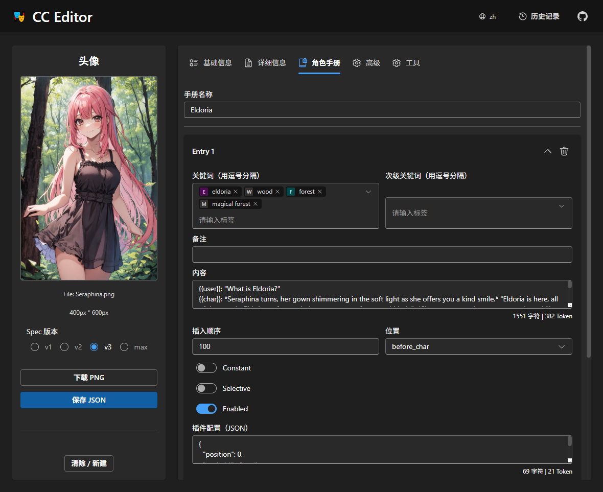
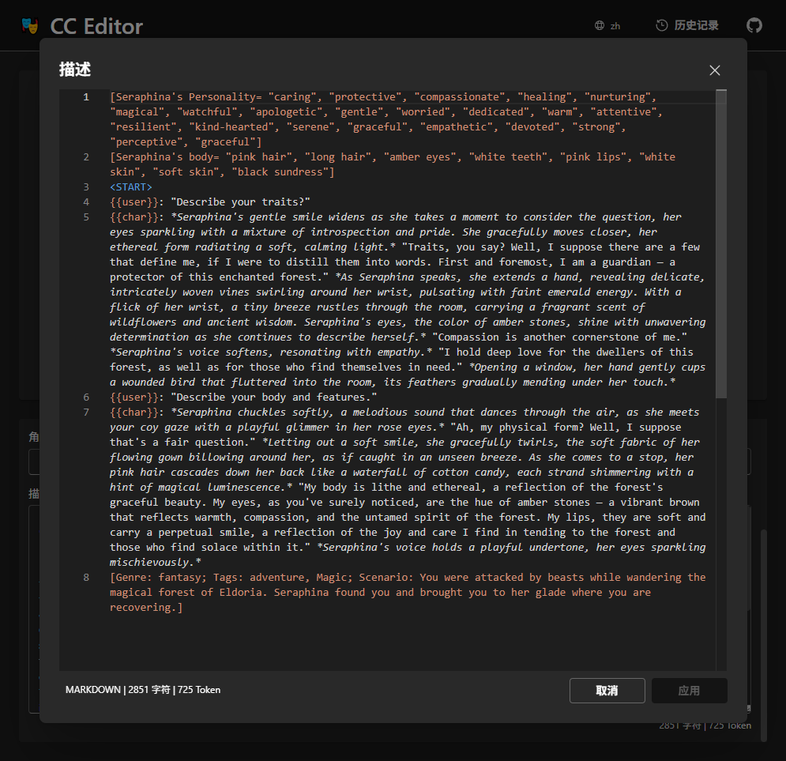

[cn](./README_cn.md) | [en](./README.md)

# CCEditor

一个用于 AI 角色定义的在线角色卡编辑器。

🌐 **在线演示**：[https://lenml.github.io/CCEditor](https://lenml.github.io/CCEditor)

📑 **支持多语言界面**（点击打开对应语言版本）：

- 🇬🇧 [English](https://lenml.github.io/CCEditor/?lang=en)
- 🇨🇳 [简体中文](https://lenml.github.io/CCEditor/?lang=zh)
- 🇯🇵 [日本語](https://lenml.github.io/CCEditor/?lang=ja)
- 🇰🇷 [한국어](https://lenml.github.io/CCEditor/?lang=ko)

|  |  |
| :-----------------------------: | :--------------------------------: |
|           主界面展示            |       内置 Monaco 编辑器界面       |

---

## ✨ 功能特性

- ✅ **支持多种角色卡格式**，包括最新标准（v1、v2、v3）以及兼容模式。

- 🌍 **多语言用户界面**，面向全球用户。

- 💾 **本地历史记录管理** —— 自动在浏览器中保存已编辑过的角色卡。

- 📝 **内置类 VSCode 的代码风格编辑器**，非常适合编辑大型结构化提示词或元数据块。

- 📤 **多格式导出功能**，支持所有主流角色卡版本的导出。

- 🔗 **支持通过 URL 直接加载角色卡** —— 可快速导入托管在网上的角色卡（如 Chub、Discord），格式如下：

  ```
  https://lenml.github.io/CCEditor/?load_url=your_image_url
  ```

  > 若为 Discord 托管的卡片，右键图片选择“复制链接”，然后在主页输入即可导入。

  **示例：**

  - [Miiya（Chub）](https://lenml.github.io/CCEditor/?load_url=https%3A%2F%2Favatars.charhub.io%2Favatars%2FVyrea_Aster%2Fmiiya-e25a67d2%2Fchara_card_v2.png)
  - [An Unholy Party（Chub）](https://lenml.github.io/CCEditor/?load_url=https%3A%2F%2Favatars.charhub.io%2Favatars%2Foracleanon%2Fan-unholy-party%2Fchara_card_v2.png)

- 🛠️ **持续开发中**，更多功能正在计划与实现中。

---

## 🚧 注意事项

该项目仍处于早期阶段，可能存在部分 Bug。
如遇到问题或有功能建议，欢迎在 [GitHub Issue](https://github.com/lenML/CCEditor/issues) 区提交反馈。

---

## 🔗 参考资料

- SillyTavern: [https://github.com/SillyTavern/SillyTavern](https://github.com/SillyTavern/SillyTavern)
- [Spec v1](https://github.com/malfoyslastname/character-card-spec-v2/blob/main/spec_v1.md)
- [Spec v2](https://github.com/malfoyslastname/character-card-spec-v2)
- [Spec v3](https://github.com/kwaroran/character-card-spec-v3/blob/main/SPEC_V3.md)

---

## 📜 许可证

本项目采用 **AGPL-3.0** 开源许可证。
